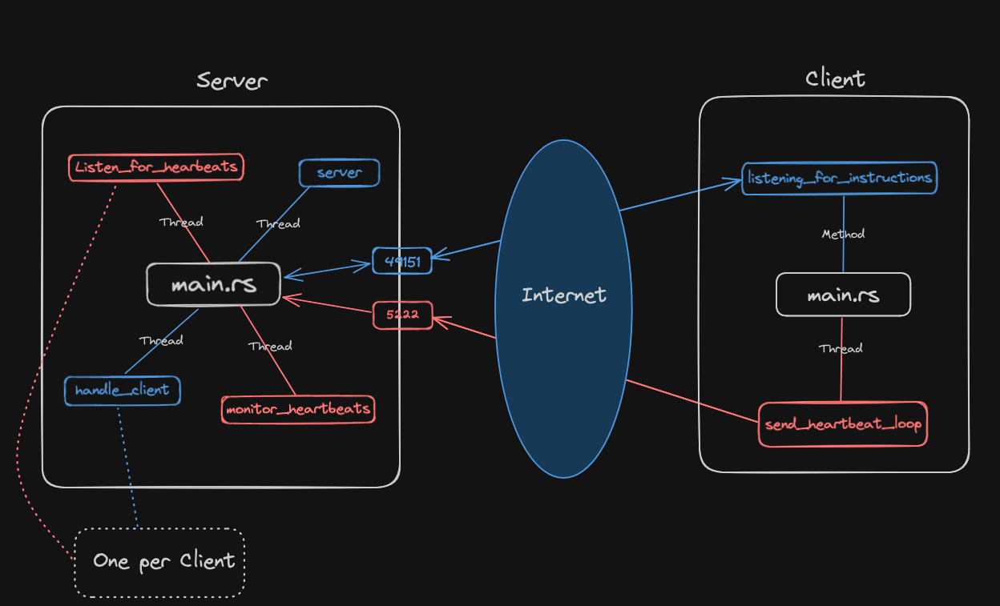

# RustC2Forge


RustC2Forge is a Command and Control (C2) server implemented in Rust, designed for educational purposes. This project represents my inaugural venture into Rust development, with the primary objective of familiarizing myself with the language. The essence of RustC2Forge is a basic reverse shell capability, laying a foundation for future expansion and the addition of more sophisticated features.

# Environment Setup
To run this project, you must have Rust installed on your computer. For installation instructions and more information on Rust, please visit the [the official Rust website](https://www.rust-lang.org/tools/install).

# How it Works


The diagram above illustrates the project's main functionality, which is divided into two distinct workspaces: /client and /server. By default, the server creates two TCP listeners: one on port 5222 for heartbeat signals and another on port 49151 for the reverse shell. The project is ready to run out of the box, but if you wish to change the IP addresses or ports used, please refer to the following files:
- server/src/main.rs
- client/src/main.rs
- server/src/handler/heartbeats.rs - function listen_for_heartbeats

## Server
To launch the server component, use the following command:
```Shell
cargo run --bin server
```

## Client
To start the client component, execute:
```Shell
cargo run --bin client
```

# Features
- Reverse Shell: Facilitates the execution of commands from the server on the connected client, acting as a basic form of a reverse shell.

- Heartbeat: A mechanism to check whether the client (victim) is still connected and active.

# Run RustC2Forge Locally
To quickly test the project, you can use your local machine as both the server and the client. This setup was my primary development environment.

## Server
Open a new terminal tab and run the server:
```Shell
cargo run --bin server
```

## Client
In a different terminal tab, run the client:
```Shell
cargo run --bin client
```

# Future Enhancements
- File Transfer: Implement the ability to transfer files to and from the client.

- Modular Structure: Refactor the codebase to adopt a more modular structure, simplifying integration with malware tools and enhancing the system's overall robustness.

# Contribution
RustC2Forge is open for contributions. Whether it's adding new features, fixing bugs, or improving documentation, your help is welcome. Please feel free to fork the repository, make your changes, and submit a pull request.

# Disclaimer
This project is for educational purposes only. The development and use of C2 servers can be associated with malicious activities. It is essential to use this project responsibly and within the boundaries of ethical guidelines and legal requirements.

